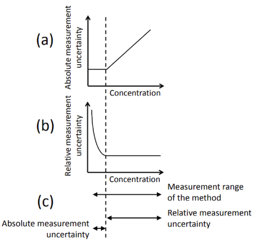

# AutoMUKit API

---

## Running without Docker

### Requirements

You will need node & npm installed in your environment.

### Installation

    $ cp .env.example .env
    $ npm install

### In development (watches file changes)

    $ npm run dev

### In production (manual build & start)

    $ npm run build
    $ npm start

### In production (using flock and cron)

    $ crontab -e
    * * * * *       cd /path/to/automukit_api && ./start.sh 

## Configuration (.env file)

    SERVER_PORT - The port number for the express server
    BASE_URL - The base url string for the web UI (used for script and css paths)
    PRECISION - The max precision number in digits (amount of decimals) for result numbers
    DEBUG - More verbose console output boolean (true | false)

## Web user interface

  For development, browse to http://localhost:3040
  *  Port can be changed by defining the SERVER_PORT in the .env file

## API

AutoMUKit API only has one endpoint which can be accessed using the url path root. Requests need to have `Content-Type: application/json` header set.

### POST request JSON format
    
    {
      "replicateSamples": [[number]],
      "references": [
        {
          "value": number,
          "uncertainty": number,
          "controlSamples": [number]
        }
      ],
      "ranges": [
        {
          "mode": "relative" | "absolute",
          "min": number,
          "max": number,
          "coverageFactor": number,
          "replicateSamplesMin": number,
          "controlSamplesMin": number
        }
      ]
    }

#### Attribute descriptions

* `replicateSamples`: Routine replicate samples
* `references`: Certified reference materials
  * `value`: Certified concentration
  * `uncertainty`: Standard uncertainty of certified concentration
  * `controlSamples`: CRM
* `ranges`: Concentration ranges
  * `mode`: Calculation mode
  * `min`: Minimum value
  * `max`: Maximum value
  * `coverageFactor`: Coverage factor k
  * `replicateSamplesMin`: Minimum amount of replicate series
  * `controlSamplesMin`: Minimum amount of CRM results

### POST response JSON format (not ok status)
The run could not be completed: API returns status code 400 if request format validation fails or 422 if the calculation fails because of an program error.   

    {
      "errors": [string]
    }

### POST response JSON format (ok status)
Successful run responds with array of results (one result object per concentration range). The result contains only `range` and `errors` attributes if the calculation for a range couldn't be completed. For successful calculation only the `range`, `uRw`, `ub`, `uncertainty` and `expandedUncertainty` attributes will be present.

    [
      {
        "range": {
          "mode": "relative" | "absolute",
          "min": number,
          "max": number,
          "coverageFactor": number,
          "replicateSamplesMin": number,
          "controlSamplesMin": number
        },           
        "uRw": number | undefined,
        "ub": number | undefined,
        "uncertainty": number | undefined,
        "expandedUncertainty": number | undefined
        "errors": [string] | undefined
      }
    ]
    
#### Attribute descriptions

* `range`: Concentration range
    * `mode`: Calculation mode
    * `min`: Minimum value
    * `max`: Maximum value
    * `coverageFactor`: Coverage factor k
    * `replicateSamplesMin`: Minimum amount of replicate series
    * `controlSamplesMin`: Minimum amount of CRM results
* `uRw`: Within-laboratory reproducibility, u(Rw)
* `ub`: Method and laboratory bias, u(bias)
* `uncertainty`: Combined standard uncertainty, uc
* `expandedUncertainty`: Expanded uncertainty, U
* `errors`: Calculation errors

## Attributes

### Certified reference materials

#### Certified concentration

The value from the certificate or the theoretical concentration for the certified reference material.

#### Standard uncertainty of certified concentration

The uncertainty of the certified value is calculated from the confidence interval given in the certificate. For example if the CRM certificate shows 11.5 +- 0.5 µg/l (95 %, k=2) then u(Cref) = 0.5 µg/l / 2 = 0.25 µg/l = 2.17 %. If the control sample is not certified but its uncertainty can be solved from how it was prepared, the control sample can be used instead of the CRM.

### Concentration ranges

Normally the measurement uncertainty is changing depending on the concentration. Therefore, it is recommended to divide the measurement range so that the absolute or relative uncertainty remains close to constant for each range.

#### Calculation mode

Relationship between (a) absolute measurement uncertainty and concentration, and (b) relative measurement uncertainty and concentration. Division of the measurement range (c) at the dashed line into a low range where the absolute measurement uncertainty is constant and a high range where the relative measurement uncertainty is approximately constant.

#### Coverage factor k

Measurement uncertainty should normally be expressed as U, the expanded measurement uncertainty, with a stated confidence level and a coverage factor, k. In most cases k = 2, providing a level of confidence of approximately 95 %

#### Replicate samples min amount

In order to have a representative basis for the uncertainty estimation the number of results should ideally be more than 60.

#### Control samples min amount

Regular measurement of one or several CRM can be used to estimate the bias. Each reference material should be measured on 5 different analytical series before the values are used.

## Testing

### Running Jest tests

    $ npm test
